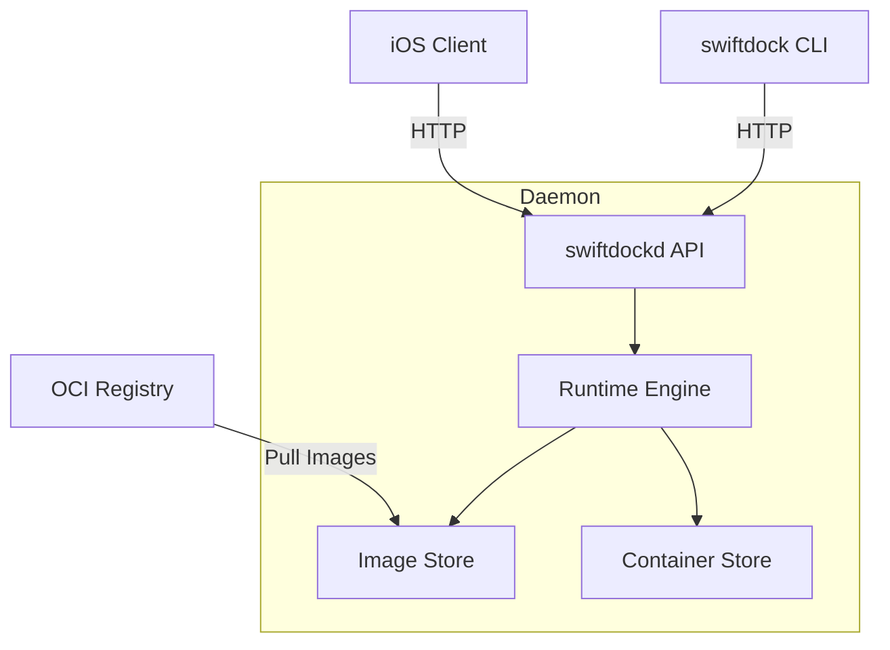

# Swiftdock Architecture

## Components

### 1. swiftdockd (Daemon)
The core service running on macOS.
- **Responsibilities**:
    - Manages image and container stores.
    - Handles container lifecycle (create, start, stop, delete).
    - Streams logs.
    - Exposes an HTTP API for clients.
- **Location**: `apps/daemon`

### 2. swiftdock (CLI)
Command-line interface for developers.
- **Responsibilities**:
    - Communicates with `swiftdockd` via HTTP API.
    - Supports standard commands: `pull`, `run`, `ps`, `logs`, `stop`, `rm`.
- **Location**: `apps/cli`

### 3. Clients (SwiftUI)
Native Apple platform clients.
- **iOS/iPadOS/visionOS**: Full control plane (list images/containers, start/stop, view logs).
- **watchOS**: Status monitoring and alerts.
- **Location**: `apps/ios-client`, `apps/watch-client`

## Data Flow

